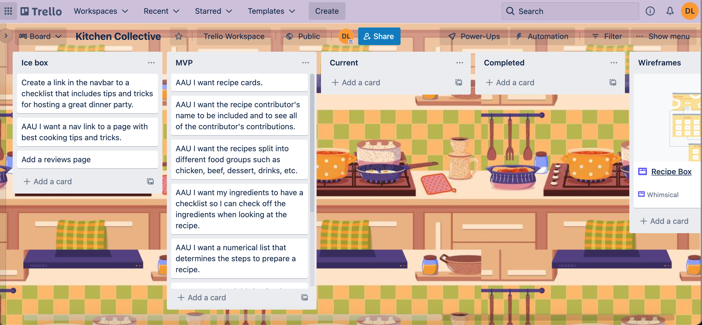

# Kitchen Collective
### Kitchen collective is a web app to create recies and share them with friends and family. Specifically I wanted to create a page where my grandma could easily login and share recipes with me so I'll stop losing the papers she gives me. I wanted it to have a granparent kitchen feel when you land on my page, mixed with a little modern fun to represent our relationship and the bond we experince through coming together and creating the most delicious recipes in the kitchen. 

## Deployed app link: https://kitchen-collective.herokuapp.com/
## Trello Link: https://trello.com/b/dAQvLxzy/kitchen-collective

## Techologies Used
### -HTML
### -CSS
### -Javascript
### -Git
### -MongoDb Mongoose
### -Express Node.Js
### -Heroku

## Next Steps:
## -I want to add my API properly because it didn't workout this time around. I plan to add on API's and make it. 
## -I want to concert my comment section to a review section for my recipes.
## -I want users to have the ability to save the recipes to their profile page.
